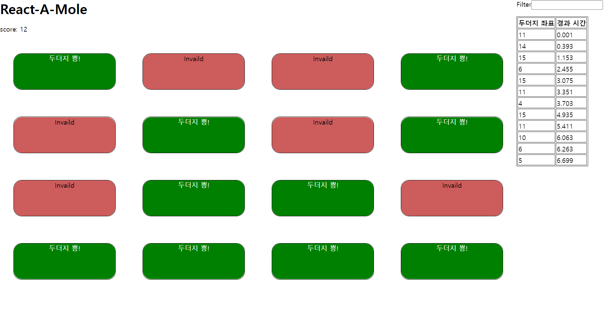

# 두더지 잡기 게임

**Watch Project** | https://app.netlify.com/sites/catch-mole-byjun/

**Tech** | React , TypeScript

**Hook** | useState , useEffect , useMole(custom hook)

**styling** | scss

## Description

- 두더지 잡기 게임으로 **16마리의 두더지를 클릭하여 잡을 수 있는 게임**이다.

- 각 두더지는 **랜덤 시간간격**으로 들어갔다 나왔다하며 **15초가 되면 모든 두더지들은 들어간다.**

- 두더지가 **들어가면 Invalid라고 표시**가 된다.

- 두더지를 잡으면 두더지를 **잡은 기록이 우측에 표시**되는데 잡은 **두더지의 좌표**(왼측 상단부터 0으로 시작하여 15로 끝남)와 **경과 시간**이 기록된다.

- 인풋을 이용하여 **원하는 두더지 좌표만 입력**해서 볼 수 있다.(필터링)
